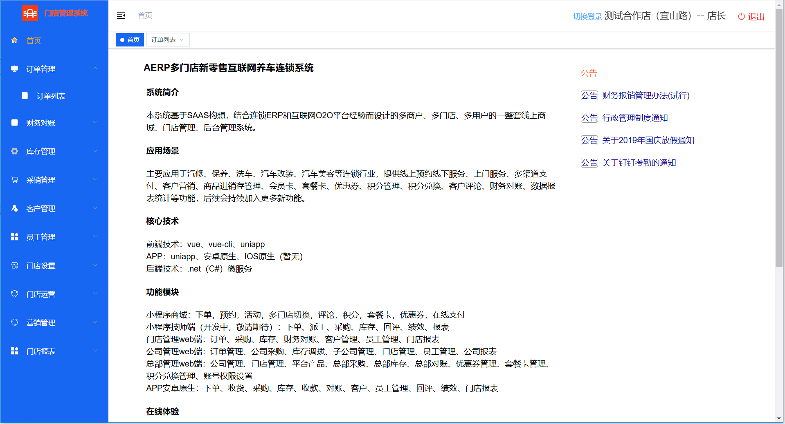

	<!--  -->

<h1 align="center" style="margin: 30px 0 30px; font-weight: bold;">ApolloErp v1.0.0</h1>
<h4 align="center">基于O2O新零售的互联网养车连锁系统</h4>

	
	
	

## 系统简介

  本系统为类似途虎养车、车享家的互联网养车平台系统，已经上线运行多年，成熟稳定。为了降低汽修连锁企业的信息化成本，决定开源此产品。针对有特殊信息化需求的企业，提供高性价比的实施服务。  

## 业务介绍

  1、针对汽修、保养、洗车、汽车改装、汽车美容等连锁企业，提供线上预约线下服务、上门服务、多渠道支付、客户营销、商品进销存管理、会员卡、套餐卡、优惠券、积分管理、积分兑换、客户评论、财务对账、数据报表统计等功能，后续会持续加入更多新功能。  
  2、本项目包含总部管理web端、公司管理web端、门店管理web端，支持多公司、多门店。  

## 安装说明

  开发环境：VS2019、MySql8.0、Redis  
  前端技术：vue、vue-cli  
  后端技术：.net core 2.1、C#、微服务  

## 开发文档

  [转到wiki](https://gitee.com/aerphouse/ApolloERP/wikis/Home)   

## 在线体验

  门店\公司管理地址：[http://shop.aerp.com.cn](http://shop.aerp.com.cn)  
  总部管理地址：[http://boss.aerp.com.cn](http://boss.aerp.com.cn)  
  账户/密码：13811112222 / 12345678  
  技术交流QQ群：221525146  

## 演示版门店管家APP下载 （目前仅支持安卓版）

## 小程序体验版

## 开源及商务合作说明

  1、开源说明：本项目完全遵循MIT协议。  
    如果你喜欢我们的产品, 可以放心从我们的开源版开始使用, 在产品商业化的支持下同时我们会尽最大的努力维护开源版的稳定。   
    后期在不影响公司业务的前提下, 会逐步开放更多的信息化平台。在此期间,如果你发现产品有任何Bug, 请在Issue模块向我们反馈，谢谢。  
  2、商务合作：本项目同时支持开源版实施和定制开发服务，  
  商务合作请 统一联系  
  QQ：19652594   
  邮箱：zhidash2020@163.com     
  
  
## 目录说明  
  Doc - 文档  
  DB - 数据库sql文件  
  Ae.Boss.Web - 总部管理web端  
  Ae.Shop.Web - 门店\公司管理web端    
  Ae.xxx.Api - api相关接口  
  Ae.xxx.Service - 业务处理微服务  
  MiniAppC - 客户端小程序    
  

## 管理端界面预览

  
## 客户端小程序界面预览

## 门店管家APP界面预览

## 捐助
如果您觉得我们的开源软件对你有所帮助，请扫下方二维码打赏我们一杯咖啡。

